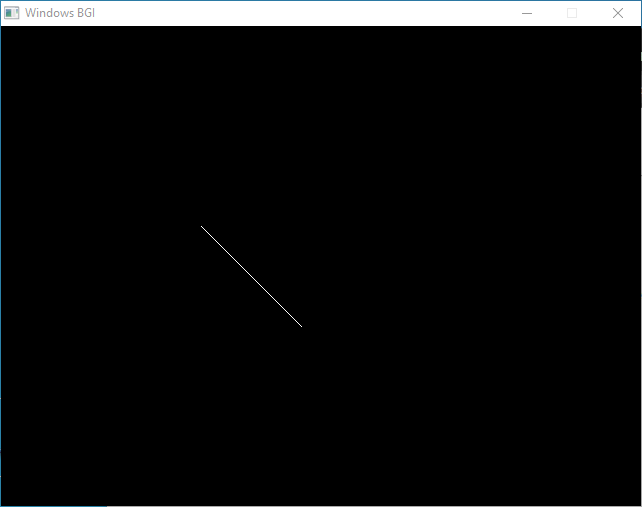

# WinBGIm

### Windows BGI - with mouse

<br>

[The WINBGIM Library -- Version 6.0 -- August 9, 2004](https://home.cs.colorado.edu/~main/cs1300/doc/bgi/bgi.html)

[website link](http://winbgim.codecutter.org/)

[WinBGIm src](http://winbgim.codecutter.org/V6_0/WinBGIm6_0_Nov2005_src.zip)

**WinBGIm6_0_Nov2005_src**

<br>

this repo is a windows port for the build system for WinBGIm library, the original one had some errors and Makefile written for linux.

<br>

## Changes made

[not written yet]

<br>

## How to build the library

- clone the repo and go the repo directory
- and run the makefile in a terminal

```powershell
$ git clone <repo-link>
$ cd <repo-name>
$ make
```

now the library is build and put in the build directory.

```text
build\
├── graphics.h
├── libbgi.a
```

<br>

## How to use the library

<br>

### folder structure:

- copy graphics.h in the includes folder of your project.
- copy libbgi.a in the lib folder of your project.

```text
include\
├── graphics.h
lib\
├── libbgi.a
main.cpp
Makefile
```

<br>

file: main.cpp

```cpp
#include <graphics.h>

int main()
{
    int gdriver = DETECT, gmode;
    initgraph(&gdriver, &gmode, (char*)"");
    line(200, 200, 300, 300);
    getch();
    closegraph();
}
```

<br>

file: Makefile

```Makefile
COMPILER=g++
CFLAGS=-Wall -g
COMPILE=$(COMPILE) $(CFLAGS)

.PHONY: all clean

all: main

main: main.o
	$(COMPILER) $< -o $@ -I includes -Llib -lbgi -lgdi32 -lcomdlg32 -luuid -loleaut32 -lole32

main.o: main.cpp
	$(COMPILER) -c $< -o $@ -I includes

clean:
	del /Q main.exe *.o
```

<br>

### Compile and run the example program

```powershell
$ make
$ ./main
```

output should be something like below:



<br>

if you don't know how to compile program with libraries, you can use the following resource:

[Compile/Link a Simple C Program](https://vdemir.github.io/linux/C-Compling-and-Linking/)
